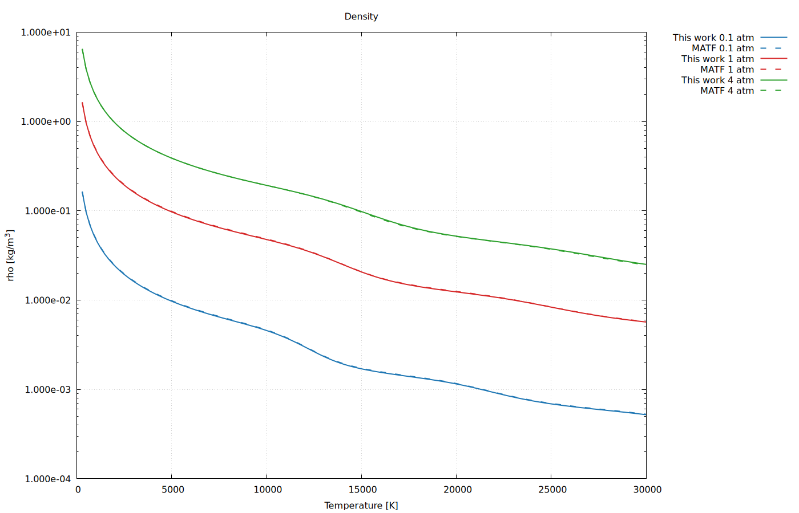
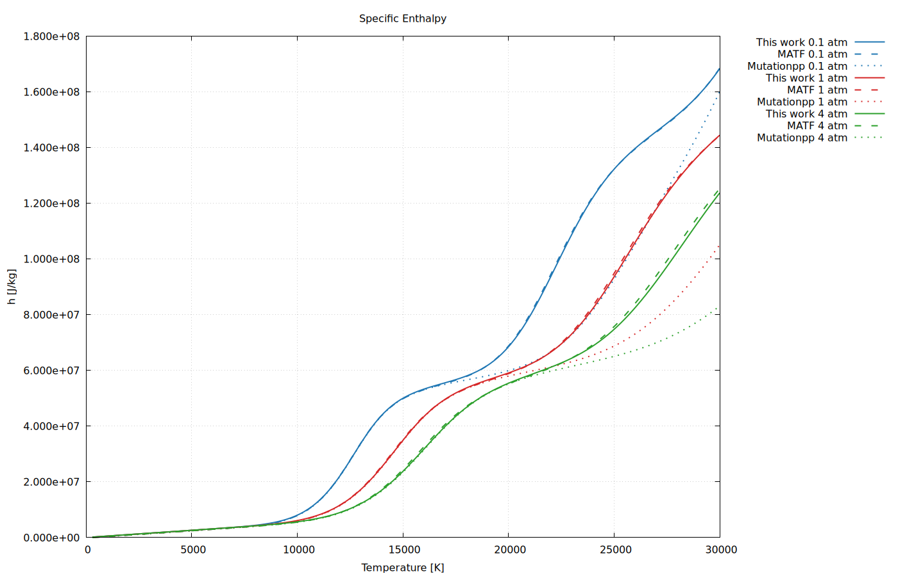
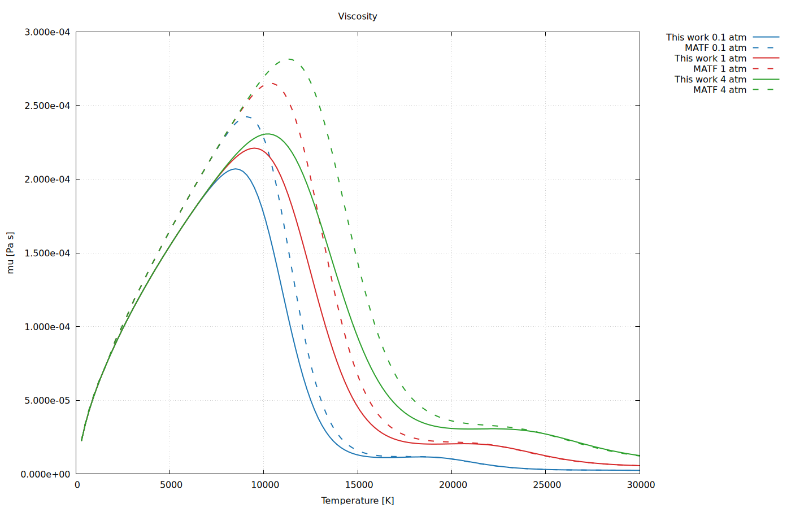
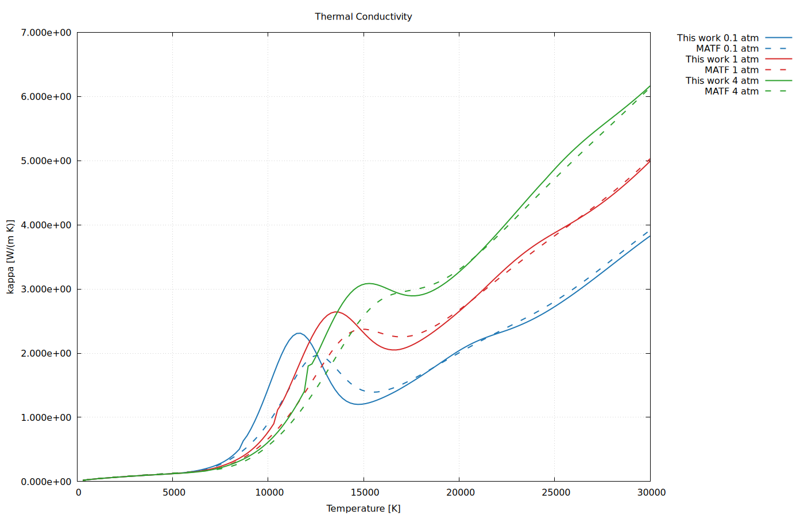
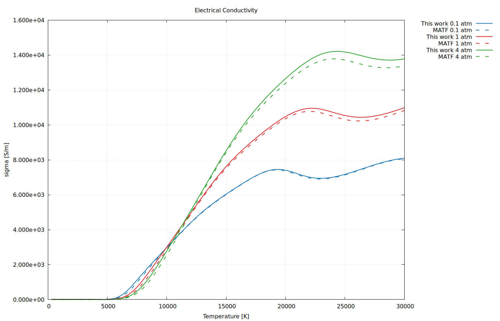
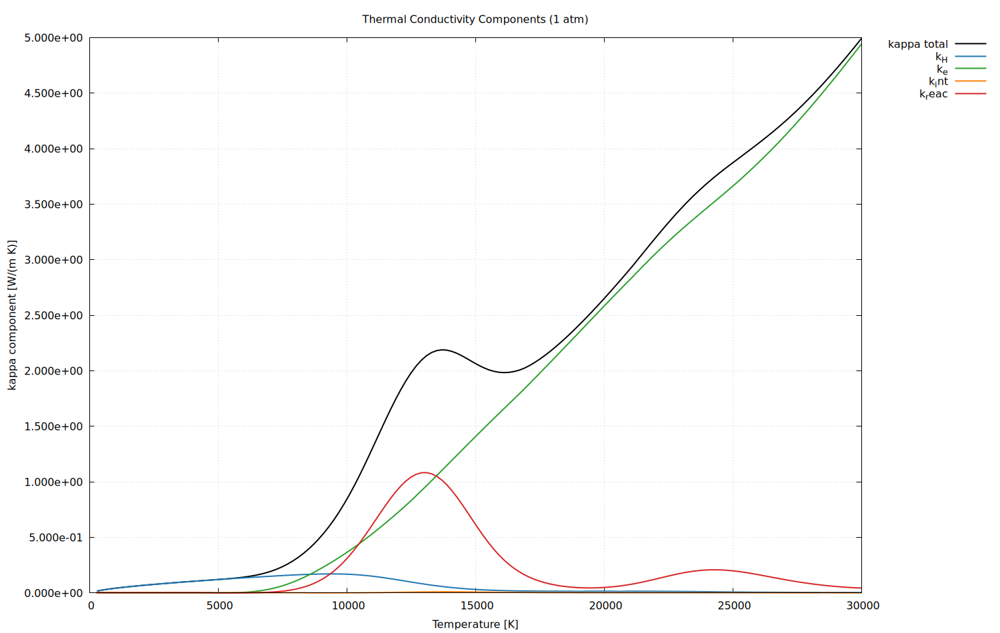
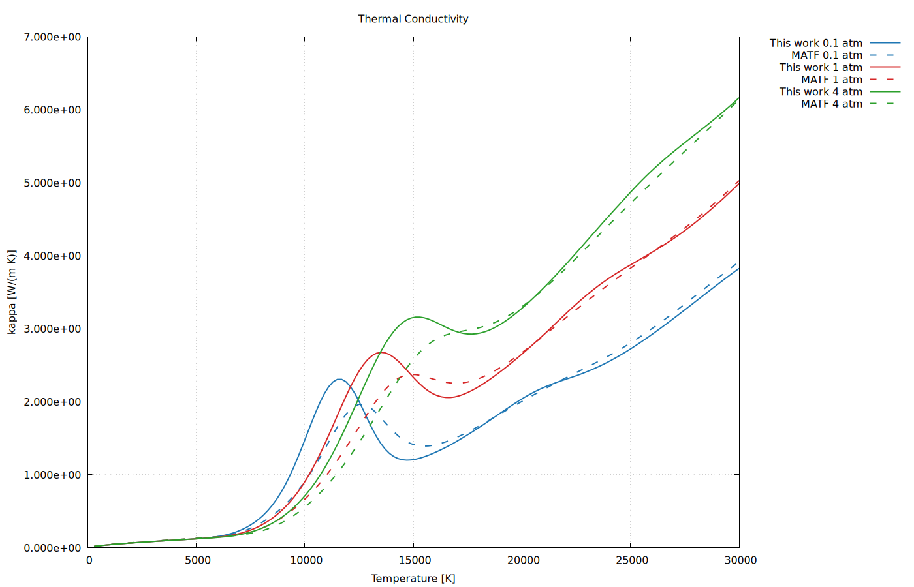
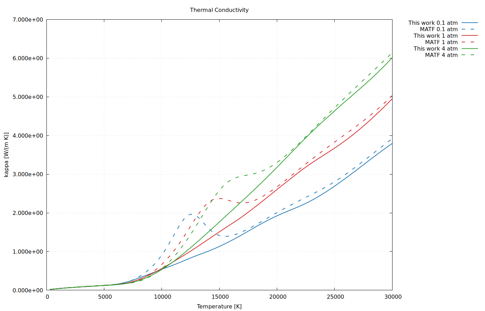
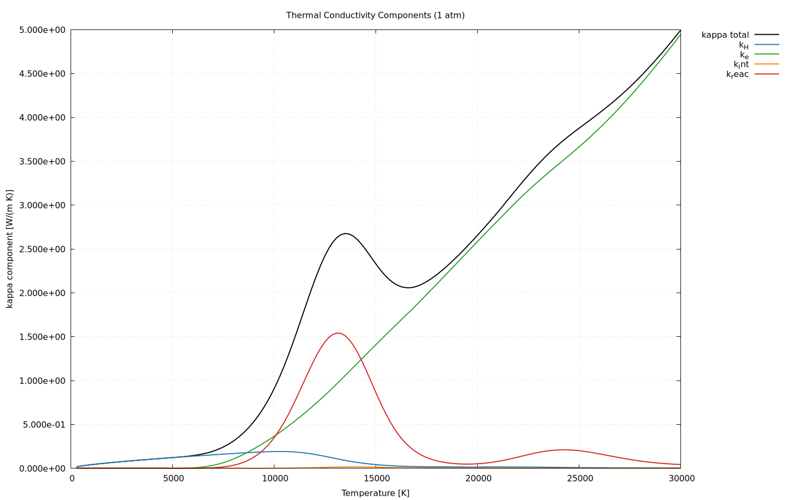
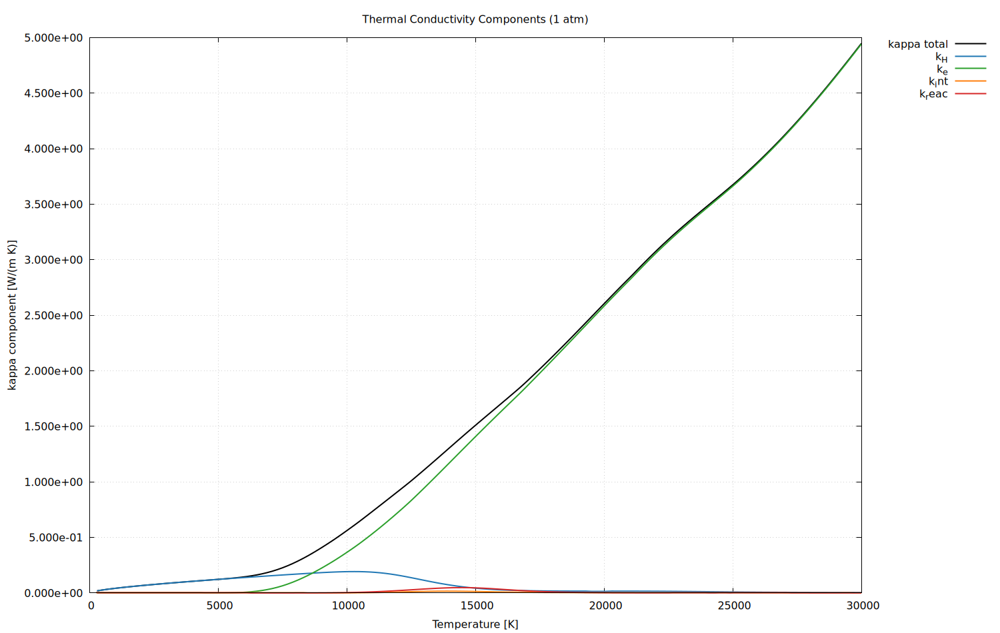

# Tutorial 01 Research Note: Ar LTE Property Pipeline (Code-Based)

본 문서는 `scripts/murphy/`의 실제 구현식을 기준으로 Tutorial 01(Ar LTE) 계산 흐름을 정리한다.

## 1. 범위와 계산 조건

- 대상 species: `Ar, Ar+, Ar2+, Ar3+, Ar4+, e-`
- 온도 범위: `300 ~ 30000 K` (기본 간격 200 K)
- 압력: `0.1, 1.0, 4.0 atm`
- 최종 출력:
  - 평형 조성 `n_i(T,P)` [m^-3]
  - 열역학 물성 `rho, h, Cp`
  - 수송 물성 `mu, kappa, sigma`

## 2. 코드 파이프라인 요약

1. `build_partition_functions.py`
2. `solve_argon_lte_equilibrium.py`
3. `build_thermo_properties.py`
4. `build_collision_integrals.py`
5. `build_transport_properties.py`

주요 중간 산출물:

- `data/processed/partition_functions/partition_functions_Ar_system.json`
- `data/processed/equilibrium/argon_lte_equilibrium_0p1_1_4atm.csv`
- `data/processed/thermo/argon_thermo_0p1_1_4atm.csv`
- `data/processed/transport/argon_collision_integrals_all.csv`
- `data/processed/transport_properties/argon_transport_0p1_1_4atm.csv`

## 3. Phase 1: Internal Partition Function

사용 코드: `scripts/murphy/build_partition_functions.py`

### 3.1 데이터 처리 규칙

- 입력: `Ar0.csv ~ Ar4.csv` (`g`, `Level (eV)`)
- `g` 결측 또는 수치 변환 불가 행은 분배함수 합산에서 제외
- 단, `g` 결측 + `Level(eV)` 유효 행은 단계별 이온화 에너지 후보로 저장

### 3.2 내부 분배함수

$$
Q_{\mathrm{int},s}(T) = \sum_j g_{s,j}\exp\!\left(-\frac{\epsilon_{s,j}}{k_B T}\right)
$$

- \(k_B = 8.617333262145\times10^{-5}\ \mathrm{eV/K}\)
- 전자 내부 분배함수는 상수로 고정:

$$
Q_{\mathrm{int},e^{-}}(T) = 2
$$

### 3.3 누적 이온화 에너지

코드에서 \(z=0\to3\) 단계 이온화 에너지를 누적하여 species 기준으로 저장:

$$
E_{\mathrm{ion},\mathrm{Ar}} = 0,\qquad
E_{\mathrm{ion},\mathrm{Ar}^{(z+1)+}} = E_{\mathrm{ion},\mathrm{Ar}^{z+}} + E_{\mathrm{stage},z}
$$

$$
E_{\mathrm{ion},e^{-}}=0
$$

## 4. Phase 2: LTE 평형 조성 솔버

사용 코드: `scripts/murphy/solve_argon_lte_equilibrium.py`

미지수:

$$
\mathbf{x} = [\ln n_{\mathrm{Ar}},\ln n_{\mathrm{Ar}^{+}},\ln n_{\mathrm{Ar}^{2+}},\ln n_{\mathrm{Ar}^{3+}},\ln n_{\mathrm{Ar}^{4+}},\ln n_e]
$$

### 4.1 열 드브로이 파장과 화학 퍼텐셜

$$
\lambda_i = \frac{h}{\sqrt{2\pi m_i k_B T}}
$$

$$
\mu_i = k_B T\left[\ln n_i + 3\ln\lambda_i - \ln Q_{\mathrm{int},i}(T)\right] + E_{\mathrm{ion},i}
$$

위 식은 다음과 동치이다:

$$
\mu_i = k_B T\ln\!\left(\frac{n_i\lambda_i^3}{Q_{\mathrm{int},i}(T)}\right)+E_{\mathrm{ion},i}
$$

### 4.2 연립 방정식

Saha 형태(화학 퍼텐셜 평형) 4개:

$$
\mu_{\mathrm{Ar}}-\mu_{\mathrm{Ar}^{+}}-\mu_e = 0
$$

$$
\mu_{\mathrm{Ar}^{+}}-\mu_{\mathrm{Ar}^{2+}}-\mu_e = 0
$$

$$
\mu_{\mathrm{Ar}^{2+}}-\mu_{\mathrm{Ar}^{3+}}-\mu_e = 0
$$

$$
\mu_{\mathrm{Ar}^{3+}}-\mu_{\mathrm{Ar}^{4+}}-\mu_e = 0
$$

전하중성(로그-비 형태):

$$
\ln n_e-\ln\!\left(n_{\mathrm{Ar}^{+}}+2n_{\mathrm{Ar}^{2+}}+3n_{\mathrm{Ar}^{3+}}+4n_{\mathrm{Ar}^{4+}}\right)=0
$$

상태방정식:

$$
\sum_i n_i k_B T-\Delta P_{\mathrm{DH}}-P=0
$$

### 4.3 Debye-Huckel 압력 보정

코드 구현:

$$
\sigma_c = \sum_i z_i^2 n_i
$$

$$
\lambda_D=\sqrt{\frac{\varepsilon_0 k_B T}{e^2 \sigma_c}},\qquad
\kappa_D=\frac{1}{\lambda_D}
$$

$$
\Delta P_{\mathrm{DH}}=\frac{k_B T\,\kappa_D^3}{24\pi}
$$

### 4.4 수치해석 전략

- 1순위: `scipy.optimize.root(hybr)`
- 2순위: 커스텀 Newton + 해석 Jacobian + line search
- 3순위: 축약 Saha-스칼라(전자밀도 1변수) fallback

출력 파일:

- `data/processed/equilibrium/argon_lte_equilibrium_0p1_1_4atm.csv`

## 5. Phase 3: 열역학 물성

사용 코드: `scripts/murphy/build_thermo_properties.py`

### 5.1 종별 엔탈피

코드에서 먼저 종별 미분항 \(\frac{d}{dT}\ln Q_{\mathrm{int},i}(T)\)를 수치미분으로 계산:

$$
\frac{d}{dT}\ln Q_{\mathrm{int},i}(T)
$$

종별 엔탈피(입자 기준, eV):

$$
H_i(T)\,[\mathrm{eV}] = \frac{5}{2}k_B T + k_B T^2\frac{d}{dT}\ln Q_{\mathrm{int},i}(T) + E_{\mathrm{ion},i}
$$

단위변환:

$$
H_i(T)\,[\mathrm{J/particle}] = H_i(T)\,[\mathrm{eV}] \times 1.602176634\times10^{-19}
$$

### 5.2 혼합물 물성

$$
\rho = \sum_i n_i m_i
$$

$$
h = \frac{1}{\rho}\sum_i n_i H_i
$$

$$
C_p = \left(\frac{\partial h}{\partial T}\right)_P
$$

코드상 \(C_p\)는 온도 축 중앙차분(경계는 1차 차분)으로 계산한다.

출력 파일:

- `data/processed/thermo/argon_thermo_0p1_1_4atm.csv`
- `data/processed/thermo/argon_cp_peaks_0_30000K.csv`

## 6. Phase 4: 충돌적분 구축

사용 코드: `scripts/murphy/build_collision_integrals.py`

출력 단위는 주로 \(m^2\)이며, 병행으로 \(A^2\) 컬럼도 저장한다.

### 6.1 충돌적분 계산 계수 및 관련 문헌

| 블록 | 핵심 계수 | 코드 적용값/정의 | 데이터/논문 출처 |
|---|---|---|---|
| Ar-Ar (neutral-neutral) | `epsilon/k`, `sigma` | `epsilon/k = 143.25 K`, `sigma = 3.3560 Angstrom` | Aziz et al. (1990), `aziz1990_hfdtcs2_constants.csv` |
| Ar-Ar+ charge exchange | `A_k`, `B_k`, `w_k` | `2Sigma: A=8.921, B=0.3960, w=1/3; 2Pi: A=6.189, B=0.2934, w=2/3` | Murphy and Tam (2014), `AR_ARP_CX_STATES` |
| Ar-Ar+ elastic (capture) | `alpha_Ar`, `z` | `alpha_Ar = 1.6411e-30 m^3`, `z=1` (Ar+), `z=2,3,4`는 확장 계산 | Ar polarizability 상수 + 코드 모델 `q_ar_arp_elastic_langevin_a2` |
| Ar-Ar2+/Ar-Ar3+/Ar-Ar4+ | `sqrt(z)` 스케일 | `Q11, Q22 ~ sqrt(z)`, `z=2,3,4` | 코드 가정 (`notes`: sqrt(z) scaling) |
| e-Ar | `Q_m(E)` | Milloy 표 + Frost 고에너지 확장, Maxwell 적분으로 `Q11, Q22, Q14, Q15` 생성 | Milloy (1977), Frost (1964), `milloy1977_*.csv`, `frost1964_*.csv` |
| charged-charged | `(T*)^2 Omega`, `A*`, `B*`, `C*` | Mason 표 보간 + Debye 길이로 환산, `coulomb_lnlambda_scale` 적용 | Mason et al. (1967), `mason1967_tableI_t2omega.csv`, `mason1967_tableII_abc.csv` |

### 6.2 Ar-Ar (neutral-neutral)

LJ surrogate:

$$
T^\*=\frac{T}{\epsilon/k}
$$

$$
\Omega_{11}^\*(T^\*)=
\frac{1.06036}{(T^\*)^{0.15610}}+0.19300e^{-0.47635T^\*}
+1.03587e^{-1.52996T^\*}+1.76474e^{-3.89411T^\*}
$$

$$
\Omega_{22}^\*(T^\*)=
\frac{1.16145}{(T^\*)^{0.14874}}+0.52487e^{-0.77320T^\*}
+2.16178e^{-2.43787T^\*}
$$

$$
Q_{11}=\Omega_{11}^\*\pi\sigma^2,\qquad
Q_{22}=\Omega_{22}^\*\pi\sigma^2
$$

### 6.3 Ar-Ar+ (ion-neutral)

공명 charge exchange:

$$
Q_{\mathrm{ex}}(E)=\sum_k w_k\left(A_k-B_k\ln E\right)^2,\qquad
Q^{(1)}(E)=2Q_{\mathrm{ex}}(E)
$$

탄성 포획모델:

$$
\sigma_{\mathrm{el}}(E)=\pi\sqrt{\frac{2C_4}{E}},\qquad
C_4=\frac{\alpha_{\mathrm{SI}}(Ze)^2}{32\pi^2\varepsilon_0^2}
$$

맥스웰 평균 후 결합:

$$
Q_{11}=\sqrt{Q_{11,\mathrm{in}}^2+Q_{11,\mathrm{el}}^2},\qquad
Q_{22}=\sqrt{Q_{22,\mathrm{in}}^2+Q_{22,\mathrm{el}}^2}
$$

고이온종 중성-이온 쌍은 코드에서 명시적으로 생성한다:

$$
Q_{11,\mathrm{Ar-Ar}^{z+}}=\sqrt{z}\,Q_{11,\mathrm{Ar-Ar}^+},\qquad
Q_{22,\mathrm{Ar-Ar}^{z+}}=\sqrt{z}\,Q_{22,\mathrm{Ar-Ar}^+},\quad z=2,3,4
$$

즉, `Ar-Ar2+`, `Ar-Ar3+`, `Ar-Ar4+` 행이 `argon_collision_integrals_non_charged.csv`에 포함된다.

### 6.4 e-Ar (electron-neutral)

에너지 단면적 \(Q_m(E)\)를 Milloy+Frost 데이터로 구성하고, 코드에서 다음 가중 평균을 사용:

$$
\langle Q\rangle_{(p)}=
\frac{\int Q(E)\,E^p e^{-E/(k_BT)}\,dE}
{\int E^p e^{-E/(k_BT)}\,dE}
$$

기본 설정:

$$
Q_{11}=\langle Q_m\rangle_{(1)},\qquad Q_{22}=Q_{11}
$$

고차항:

$$
Q_{14}^{\mathrm{moment}}=\langle Q_m\rangle_{(4)},\qquad
Q_{15}^{\mathrm{moment}}=\langle Q_m\rangle_{(5)}
$$

$$
Q_{14}=(1-\beta)Q_{11}+\beta Q_{14}^{\mathrm{moment}},\qquad
Q_{15}=(1-\beta)Q_{11}+\beta Q_{15}^{\mathrm{moment}}
$$

여기서 \(\beta\)는 옵션 `--e-ar-high-order-blend` (기본 0.0)이다.

### 6.5 charged-charged (screened Coulomb)

Debye 길이:

$$
\lambda_D=\sqrt{\frac{\varepsilon_0 k_B T}{n_{\mathrm{screen}}e^2}}
$$

\(n_{\mathrm{screen}}\)은 기본적으로 \(n_e\)를 사용한다(`electron_only`).

보조 길이:

$$
b=\frac{|z_1z_2|e^2}{8\pi\varepsilon_0 k_B T}
$$

감산 온도:

$$
T^\*=\frac{1}{2}\frac{\lambda_D}{b}
$$

Mason table의 \((T^\*)^2\Omega\) 값을 보간해 실제 적분으로 환산:

$$
Q_{ls} = S_{\mathrm{coul}}\cdot\left[(T^\*)^2Q_{ls}\right]_{\mathrm{table}}
\cdot\frac{\pi\lambda_D^2}{(T^\*)^2}
$$

\(S_{\mathrm{coul}}\)은 `--coulomb-lnlambda-scale`.

이 블록은 다음 charged species 집합의 모든 쌍(\(i\le j\))에 대해 계산된다:

$$
\{e^-,\mathrm{Ar}^+,\mathrm{Ar}^{2+},\mathrm{Ar}^{3+},\mathrm{Ar}^{4+}\}
$$

따라서 `e--Ar2+`, `Ar+-Ar3+`, `Ar2+-Ar4+`, `Ar4+-Ar4+` 등의 충돌적분이
압력별(`P_atm`)로 명시 저장된다.

출력 파일:

- `data/processed/transport/argon_collision_integrals_non_charged.csv`
- `data/processed/transport/argon_collision_integrals_charged_by_pressure.csv`
- `data/processed/transport/argon_collision_integrals_all.csv`

## 7. Phase 5: 수송계수 계산

사용 코드: `scripts/murphy/build_transport_properties.py`

### 7.1 보조 정의

환산질량:

$$
\mu_{ij}=\frac{m_im_j}{m_i+m_j}
$$

충돌속도계수:

$$
K_{ij}=Q_{11,ij}\sqrt{\frac{8k_BT}{\pi\mu_{ij}}}
$$

또한 코드에서 사용하는 \(nD_{ij}\)는 다음과 같다:

$$
nD_{ij}=\frac{3}{16}\frac{\sqrt{2\pi k_B T\,(m_i+m_j)/(m_im_j)}}{Q_{11,ij}}
$$

### 7.2 점성 \( \mu \): heavy 1차 Devoto 행렬

heavy species \(i,j\in\{\mathrm{Ar},\mathrm{Ar}^{+},\mathrm{Ar}^{2+},\mathrm{Ar}^{3+},\mathrm{Ar}^{4+}\}\)에 대해
행렬 \(A_\mu\alpha_\mu=x_h\)를 구성한다.

코드 핵심 계수:

$$
\eta_i=\frac{5}{16}\sqrt{\pi k_B}\,\frac{\sqrt{m_iT}}{Q_{22,ii}}
$$

$$
A_{\mu,ii}\leftarrow \frac{x_i^2}{\eta_i}
$$

$$
A_{\mu,ij}\leftarrow
\frac{x_ix_j}{nD_{ij}(m_i+m_j)}\left(1.2A_{ij}^\*-2\right)\quad(i\neq j)
$$

해를 이용해:

$$
\mu=\sum_i x_i\alpha_{\mu,i}
$$

### 7.3 중입자 병진 열전도도 \(k_H\): 2차 행렬

행렬 \(A_H\alpha_H=x_h\)를 구성:

$$
A_{H,ii}\leftarrow \frac{4}{15k_B}\frac{x_i^2m_i}{\eta_i}
$$

\(i\neq j\)에 대해, \(m_{i,ij}=m_i/(m_i+m_j)\), \(m_{j,ij}=m_j/(m_i+m_j)\), \(f_{ij}=x_ix_j/(25k_B nD_{ij})\)라 두면:

$$
A_{H,ij}\leftarrow f_{ij}\,m_{i,ij}m_{j,ij}\left(16A_{ij}^\*+12B_{ij}^\*-55\right)
$$

$$
A_{H,ii}\leftarrow A_{H,ii}+f_{ij}\left[m_{i,ij}\left(30m_{i,ij}+16m_{j,ij}A_{ij}^\*\right)+m_{j,ij}^2\left(25-12B_{ij}^\*\right)\right]
$$

$$
A_{H,jj}\leftarrow A_{H,jj}+f_{ij}\left[m_{j,ij}\left(30m_{j,ij}+16m_{i,ij}A_{ij}^\*\right)+m_{i,ij}^2\left(25-12B_{ij}^\*\right)\right]
$$

$$
k_H=\sum_i x_i\alpha_{H,i}
$$

### 7.4 전자 블록: Lee 3차 행렬

전자-중입자 충돌적분으로 \(L\)-모멘트를 만든다:

$$
\dot L_{00}=\sum_h x_h Q_{11,eh}
$$

$$
\dot L_{01}=\sum_h x_h\left(2.5Q_{11,eh}-3Q_{12,eh}\right)
$$

$$
\dot L_{11}=\sum_h x_h\left(6.25Q_{11,eh}-15Q_{12,eh}+12Q_{13,eh}\right)
$$

$$
\dot L_{02}=\sum_h x_h\left(\frac{35}{8}Q_{11,eh}-10.5Q_{12,eh}+6Q_{13,eh}\right)
$$

$$
\dot L_{12}=\sum_h x_h\left(\frac{175}{16}Q_{11,eh}-\frac{315}{8}Q_{12,eh}+57Q_{13,eh}-30Q_{14,eh}\right)
$$

$$
\dot L_{22}=\sum_h x_h\left(\frac{1225}{64}Q_{11,eh}-\frac{735}{8}Q_{12,eh}+199.5Q_{13,eh}-210Q_{14,eh}+90Q_{15,eh}\right)
$$

전자-중입자 고차 충돌적분은 코드에서 다음 폐쇄를 사용한다:

$$
Q_{12,eh}=C_{eh}^\*Q_{11,eh},\qquad
Q_{13,eh}=\frac{5Q_{12,eh}-B_{eh}^\*Q_{11,eh}}{4}
$$

(\(Q_{14,eh},Q_{15,eh}\)는 CSV에 존재하면 사용, 없으면 \(Q_{13,eh}\)로 fallback)

그 후 3x3 Lee 행렬을 구성하여 전자 수송을 계산한다.

$$
L_{00}=\dot L_{00},\quad
L_{01}=\dot L_{01},\quad
L_{02}=\dot L_{02}
$$

$$
L_{11}=\dot L_{11}+x_e\sqrt{2}\,Q_{22,ee}
$$

$$
L_{12}=\dot L_{12}+x_e\sqrt{2}\left(1.75Q_{22,ee}-2Q_{23,ee}\right)
$$

$$
L_{22}=\dot L_{22}+x_e\sqrt{2}\left(\frac{77}{16}Q_{22,ee}-7Q_{23,ee}+5Q_{24,ee}\right)
$$

전기전도도:

$$
\sigma = \frac{n_e e^2}{k_B T}D_{e}^{(3)}
$$

코드에서 \(D_e^{(3)}\)는 아래 보정인자를 통해 계산한다:

$$
\mathrm{leefac}=\frac{16P}{3k_BT}\sqrt{\frac{m_e}{2\pi k_BT}},\qquad
D_e^{(3)}=\frac{(\mathrm{Lee}^{-1}[1,0,0]^T)_0}{\mathrm{leefac}}
$$

전자 병진 열전도도:

$$
k_e=\frac{75k_B}{64}\sqrt{\frac{2\pi k_BT}{m_e}}
\cdot x_e\cdot\frac{L_{22}}{L_{11}L_{22}-L_{12}^2}
$$

코드에서는 분모가 작을 때 1차 fallback 형태를 함께 둔다.

### 7.5 내부/반응 열전도도

내부 열전도도:

$$
k_{\mathrm{int}}=\mu\frac{C_{p,\mathrm{internal}}}{Pr_{\mathrm{int}}}
$$

여기서

$$
C_{p,\mathrm{internal}}=\max(C_{p,\mathrm{frozen}}-C_{p,\mathrm{trans}},0)
$$

반응 열전도도(코드 다중 모델):

질량분율 기울기형:

$$
k_{\mathrm{reac,mass}}=
\rho\sum_h D_h\left(h_h-h_{\mathrm{mix}}\right)\frac{dY_h}{dT}
$$

몰분율 기울기형:

$$
k_{\mathrm{reac,mole}}=
n_{\mathrm{tot}}\sum_h D_h\left(h^{(p)}_h-h^{(p)}_{\mathrm{mix}}\right)\frac{dx_h}{dT}
$$

비열 증폭형:

$$
k_{\mathrm{reac,cp}}=\mu\frac{\max(C_p-C_{p,\mathrm{frozen}},0)}{Pr_{\mathrm{heavy}}}
$$

최종 조합은 `--k-reac-model` 선택(`legacy_composite`, `butler_mass`, `butler_mole`, `butler_mole_cp`)과
`--reaction-scale`을 따른다.

`--k-reac-model=auto`일 때 기본값은 다음과 같다.

- 기본 모드: `legacy_composite`
- `--murphy-strict` 모드: `butler_mole`

### 7.6 최종 합성

$$
\kappa = k_H + k_e + k_{\mathrm{int}} + k_{\mathrm{reac}}
$$

출력 파일:

- `data/processed/transport_properties/argon_transport_0p1_1_4atm.csv`
- `data/processed/transport_properties/argon_transport_sensitivity_report.json`
- `data/processed/transport_properties/argon_transport_metadata.json`

### 7.7 `kappa` 불일치 진단 (MATF 대비)

동일 격자(`T=300~30000 K`, `P=0.1/1/4 atm`) 비교 결과:

- strict 기본(`--murphy-strict`, `k_reac=butler_mole(auto)`)
  - `mu` 평균 APE: `3.39%`
  - `kappa` 평균 APE: `10.69%`
  - `sigma` 평균 APE: `17.46%`
- strict + MATF 정합 옵션(`--murphy-strict --k-reac-model legacy_composite`)
  - `mu` 평균 APE: `3.39%`
  - `kappa` 평균 APE: `10.22%`
  - `sigma` 평균 APE: `17.46%`

`kappa` 오차는 이온화 구간(`8,000~18,000 K`)에서 가장 크게 나타난다.
대표적으로 `0.1 atm, 12100 K`에서:

- strict 기본: `kappa = 0.778 W/(m K)` (MATF `1.895`) -> `58.97%` 과소예측
- strict + legacy: `kappa = 2.210 W/(m K)` (MATF `1.895`) -> `16.59%` 과대예측

이 지점에서 지배 원인은 `k_reac` 모델 선택이다.

- strict 기본(`butler_mole`)일 때 `k_reac ≈ 0.058 W/(m K)`
- 같은 충돌적분에서 `legacy_composite`일 때 `k_reac ≈ 1.490 W/(m K)`

즉, `mu/sigma`는 충돌적분과 전자 3차 행렬계에 주로 좌우되어 경향이 유지되지만,
`kappa`는 `k_reac` closure에 매우 민감하게 반응한다.

MATF와의 수치 정합을 우선할 경우, transport 단계에서 아래 옵션을 권장한다.

- `--k-reac-model legacy_composite` 또는 `--k-reac-model butler_mole_cp`

## 8. 결과 그래프 (GitHub 렌더링)

아래 요약 그래프(`rho`, `h`, `Cp`, `mu`, `kappa`, `sigma`)는
실선(`This work`)과 점선(`MATF`)을 함께 표시한다.
`kappa components` 그래프는 요청대로 MATF 점선을 추가하지 않는다.

현재 그림은 `--murphy-strict --k-reac-model legacy_composite` 실행 결과를 기준으로 업데이트되어 있다.

### 8.1 Thermodynamic

`rho vs T`



`h vs T` (specific enthalpy)



`Cp vs T (0~30000 K)`


### 8.2 Transport

`mu vs T`



`kappa vs T`



`sigma vs T`



`kappa components @ 1 atm`



### 8.3 `kappa` 모델 스캔 이미지 (all models)

생성 경로:

- `data/processed/transport_properties/model_scan/{model}/plots/kappa_vs_T.png`
- `data/processed/transport_properties/model_scan/{model}/plots/kappa_components_1atm.png`
- 요약 지표 CSV: `data/processed/transport_properties/model_scan/kappa_model_metrics_vs_matf.csv`

ALL 압력 평균 오차 요약(`kappa_model_metrics_vs_matf.csv`):

| model | mu mean APE [%] | kappa mean APE [%] | sigma mean APE [%] | kappa signed bias [%] |
|---|---:|---:|---:|---:|
| legacy_composite | 3.3863 | 10.2182 | 17.4570 | +6.2743 |
| butler_mole_cp | 3.3863 | 10.3258 | 17.4570 | +6.2322 |
| butler_mass | 3.3863 | 10.6496 | 17.4570 | -10.0910 |
| auto | 3.3863 | 10.6929 | 17.4570 | -10.1331 |
| butler_mole | 3.3863 | 10.6929 | 17.4570 | -10.1331 |

`kappa vs T` (model별):

`auto` (`--murphy-strict` + `--k-reac-model auto`)


`legacy_composite`



`butler_mass`



`butler_mole`


`butler_mole_cp`


`kappa components @ 1 atm` (model별):






`mu vs T` (model별):


`sigma vs T` (model별):


## 9. 재현 실행

```bash
python3 scripts/murphy/build_partition_functions.py
python3 scripts/murphy/solve_argon_lte_equilibrium.py
python3 scripts/murphy/build_thermo_properties.py
python3 scripts/murphy/build_collision_integrals.py --murphy-strict
python3 scripts/murphy/build_transport_properties.py --murphy-strict
```

`kappa` MATF 정합 우선 실행:

```bash
python3 scripts/murphy/build_transport_properties.py --murphy-strict --k-reac-model legacy_composite
```

## 10. 참고

- NIST ASD Energy Levels: https://physics.nist.gov/PhysRefData/ASD/levels_form.html
- 상세 코드:
  - `scripts/murphy/build_partition_functions.py`
  - `scripts/murphy/solve_argon_lte_equilibrium.py`
  - `scripts/murphy/build_thermo_properties.py`
  - `scripts/murphy/build_collision_integrals.py`
  - `scripts/murphy/build_transport_properties.py`
